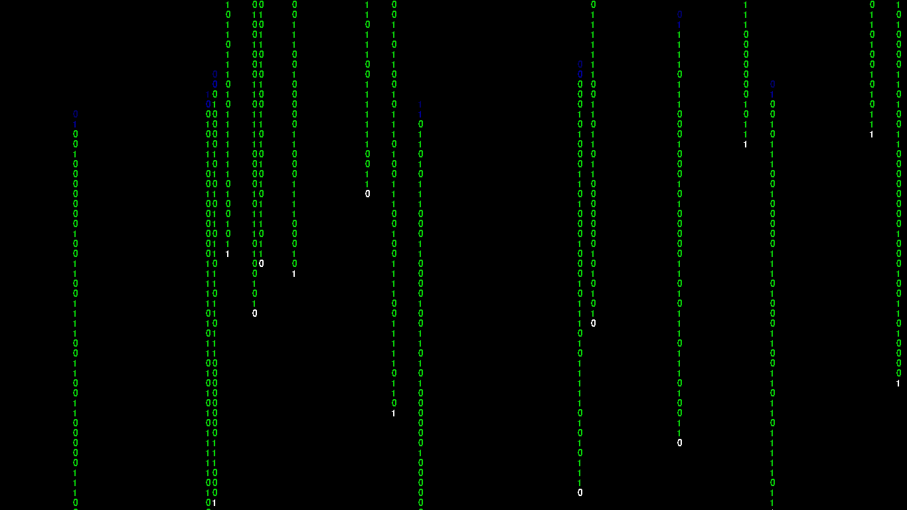

# Matrix-Rain
Matrix Rain effect using pygame

> You need python 3.5 to run this script.
>
> Install pygame with:
> `pip install pygame`
___

### Screenshots:
#### Alphanumeric Matrix:

___
#### Binary Matrix:

